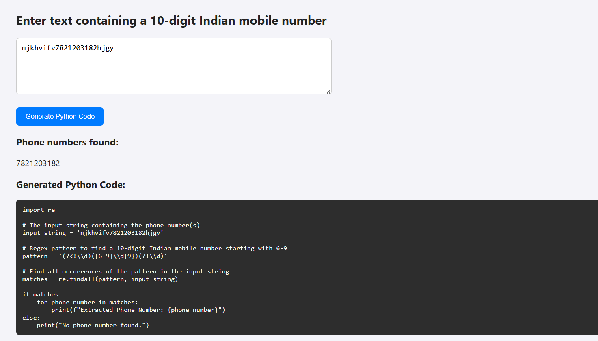

 Finds **valid 10-digit Indian mobile numbers** starting with 6–9.
-  Works even if the number is stuck to words — like `8921203173hello`.
-  Lets you run it right in your browser.
-  Generates **ready-to-use Python code** you can copy-paste into your own scripts.
-  Comes with a clean, minimal UI — no distractions.

